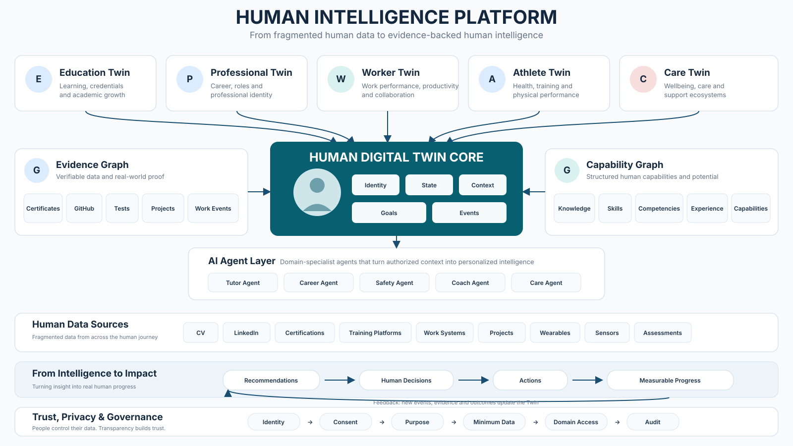

# Human Intelligence Platform — Governed Control Plane

> From fragmented human data to evidence-backed human intelligence.

This repository is the **governed control plane, architecture, research, evidence and execution workspace** for developing the **Human Intelligence Platform (HIP)** from hypothesis to validated MVP.

It also manages **NVIDIA Inception as a separate technology-evaluation and startup-acceleration track**. NVIDIA Inception supports the product journey; it does not define the product roadmap.

The project explores a persistent, permission-aware **Human Digital Twin Core** that connects evidence, capabilities, domain-specific context and AI agents to support measurable human progress.

---

## 1. Project thesis

Human data already exists across many disconnected systems:

- education and credentials;
- professional history and projects;
- assessments and training;
- work systems and events;
- wearables and sensors;
- human goals and outcomes.

The core hypothesis is that these fragments can be transformed into a longitudinal, evidence-backed representation of human capability that AI systems can use more safely and effectively.

The conceptual flow is:

```text
HUMAN DATA / EVENTS
        ↓
EVIDENCE
        ↓
HUMAN DIGITAL TWIN CORE
        ↓
CAPABILITY INTELLIGENCE
        ↓
PERMISSIONED DOMAIN CONTEXT
        ↓
AI AGENTS
        ↓
HUMAN DECISIONS
        ↓
ACTIONS / OUTCOMES
        ↓
MEASURABLE PROGRESS
        ↺
```

The long-term north star is:

## Verified Human Progress

The platform should ultimately be evaluated by evidence-backed human outcomes, not by prompt volume, token volume or number of agents.

---

## 2. Canonical architecture

The current canonical architecture is represented by the governed diagram below.



Semantic source of truth:

- [Architecture diagram contract v0.1](contracts/architecture/HUMAN_INTELLIGENCE_PLATFORM_DIAGRAM_CONTRACT_v0.1.json)
- [Canonical SVG architecture diagram v0.1](assets/architecture/human-intelligence-platform/human-intelligence-platform-overview_v0.1.svg)
- [Personal and Enterprise Digital Twin contract](contracts/architecture/PERSONAL_ENTERPRISE_DIGITAL_TWIN_CONTRACT_v0.1.json)
- [Personal and Enterprise Digital Twin architecture contract](contracts/architecture/PERSONAL_ENTERPRISE_DIGITAL_TWIN_ARCHITECTURE_CONTRACT_v0.2.json)
- [Digital Twin maturity contract](contracts/architecture/DIGITAL_TWIN_MATURITY_CONTRACT_v0.1.json)

The **JSON contract governs semantics**.  
The **SVG is the canonical repository-native visual representation**.  
Future PNG, PDF and PPTX exports are derived presentation artifacts.

The diagram contract governs the core platform flow. The Personal and Enterprise contracts extend that baseline with the two Digital Twin scopes and their Authorized Relationship Layer. These extensions remain architecture-level unless implementation and validation evidence exists.

---

## 3. Core platform model

### Human Digital Twin Core

The Human Digital Twin Core is the persistent, permission-aware representation of the person's current longitudinal state.

Current conceptual components:

```text
Identity
State
Context
Goals
Events
```

The Twin is not intended to indiscriminately duplicate all source data. It should maintain the minimum structured state and references needed to reason over evidence, capabilities, goals and authorized context.

### Personal Digital Twin

The Personal Digital Twin is the person's persistent representation across identity, state, context, goals, events, evidence, capabilities and outcomes. The proposed human flourishing organization contains seven life domains, but the current MVP must still select one permissioned domain view.

### Enterprise Digital Twin

The Enterprise Digital Twin represents an organization and its current state. It may contain nested People Twins, Asset Twins, Process Twins and Product Twins. An Asset Twin is therefore a component of an Enterprise Twin, not a synonym for the enterprise itself.

### Authorized Relationship Layer

The Authorized Relationship Layer connects Personal and Enterprise Twins through roles, projects, permissions, skills, goals and outcomes. It answers who may use which context, for what purpose and under what consent. It does not grant unrestricted cross-domain access.

### Evidence Graph

Primary question:

> How do we know?

Initial evidence classes include:

- certificates;
- GitHub;
- assessments/tests;
- projects;
- work events.

The Evidence Graph is intended to preserve provenance and distinguish claims from evidence-supported capabilities.

### Capability Graph

Primary question:

> What can this person demonstrably do?

Initial capability dimensions include:

- knowledge;
- skills;
- competencies;
- experience;
- capabilities.

The Capability Graph is intended to connect evidence-backed human capability with roles, learning, technologies, projects and future goals.

---

## 4. Domain Twins / permissioned domain views

The platform uses one Human Twin Core with multiple permissioned domain-specific views. These operational views sit within the broader Personal Digital Twin scope and may participate in authorized relationships with an Enterprise Digital Twin.

Current conceptual domains:

| Domain | Purpose |
|---|---|
| **Education Twin** | Learning, credentials and academic growth |
| **Professional Twin** | Career, roles and professional identity |
| **Worker Twin** | Work performance, productivity, authorization and industrial context |
| **Athlete Twin** | Health, training and physical performance |
| **Care Twin** | Wellbeing, care and support ecosystems |

These should be implemented as **permissioned views/extensions of one Human Twin Core**, not as disconnected copies of the same person.

The seven-domain human flourishing model and the seven Enterprise Twin domains are architecture-level organizing proposals. They do not replace the five current operational domain views and do not authorize implementation of all domains in the MVP.

---

## 5. AI Agent Layer

Agents are consumers of authorized context. They are not the source of truth about the person.

Initial conceptual agents:

| Agent | Domain |
|---|---|
| Tutor Agent | Education |
| Career Agent | Professional development |
| Safety Agent | Worker / industrial safety |
| Coach Agent | Athlete / performance |
| Care Agent | Care |

Expected agent context should be composed from:

```text
Authorized Twin State
+
Relevant Evidence
+
Capability Graph
+
Current Context
+
Goals
+
Domain Knowledge
+
Policies
```

Agents may produce recommendations, explanations, plans, alerts or next actions, but **human decisions remain in the loop**.

---

## 6. Human data sources

Potential input systems include:

```text
CV
LinkedIn
Certifications
Training platforms
Work systems
Projects
Wearables
Sensors
Assessments
```

The presence of a source in the architecture does **not** imply that an integration currently exists.

Every integration must be separately designed, authorized and validated.

---

## 7. Intelligence-to-impact loop

The intended product loop is:

```text
RECOMMENDATIONS
      ↓
HUMAN DECISIONS
      ↓
ACTIONS
      ↓
MEASURABLE PROGRESS
      ↓
NEW EVENTS / EVIDENCE
      ↺
```

Outcomes should generate new events and evidence that can update the Human Twin and Capability Graph.

This feedback loop is an architectural hypothesis until validated through working experiments.

---

## 8. Trust, privacy and governance

Trust is part of the architecture.

Baseline governance flow:

```text
IDENTITY
   ↓
CONSENT
   ↓
PURPOSE
   ↓
MINIMUM REQUIRED DATA
   ↓
DOMAIN ACCESS
   ↓
AUDIT
```

Baseline principles:

- least privilege;
- purpose limitation;
- minimum necessary data;
- domain isolation;
- evidence provenance;
- auditability;
- revocation;
- human oversight.

A recruiter should not automatically receive health data.  
A coach should not automatically receive professional data.  
A safety workflow should receive only the worker context required for the task.

---

## 9. NVIDIA Inception track

This repository also governs the technical and application work required to evaluate fit with **NVIDIA Inception**.

NVIDIA is treated as an acceleration / technology evaluation track, not as the product roadmap itself.

The rule is:

```text
WORKLOAD
   ↓
REQUIREMENT
   ↓
BENCHMARK
   ↓
NVIDIA CAPABILITY
   ↓
POC
   ↓
EVIDENCE
```

Not:

```text
NVIDIA TECHNOLOGY
        ↓
FIND A USE CASE
```

Candidate workload areas may eventually include:

- AI inference;
- agentic AI;
- evaluation and guardrails;
- computer vision;
- edge inference;
- industrial digital twins;
- physical AI.

No NVIDIA dependency or partnership should be claimed unless demonstrated or formally established.

---

## 10. Development scope

The current target development sequence is:

```text
P00 — Foundation / Governance
 ↓
P01 — Problem + Beachhead Validation
 ↓
P02 — Human Twin Core
 ↓
P03 — Evidence Graph
 ↓
P04 — Capability Graph
 ↓
P05 — One Domain View
 ↓
P06 — One Agent MVP
 ↓
P07 — Pilot / Evidence
 ↓
P08 — NVIDIA Workload Evaluation
 ↓
P09 — Domain Expansion
 ↓
P10 — Physical AI / Edge / Industrial Extensions
```

The MVP should remain deliberately smaller than the full vision.

Initial MVP target:

```text
Identity + Consent
+
Human Twin Core
+
Events
+
Evidence Graph
+
Capability Graph
+
ONE Domain View
+
ONE Agent
```

---

## 10A. Business model hypothesis

The platform's business model hypothesis is broader than the first student use case. Human Intelligence Platform may operate through three related motions:

```text
Human Intelligence Platform
│
├── B2C — Business to Customer
│   └── A person manages a Personal Digital Twin
│
├── B2E — Business to Enterprise
│   └── An organization manages an Enterprise Digital Twin
│
└── B2B — Business to Business
    └── Organizations interact through authorized Digital Twin relationships
```

### B2C — Personal Digital Twin

The individual manages identity, evidence, capabilities, goals, context and measurable progress. The student is only the first provisional beachhead for validating one product loop. The student is not the complete market definition or the complete business model.

### B2E — Enterprise Digital Twin

The organization manages its organizational state and nested People, Asset, Process and Product Twins. This motion requires a validated enterprise use case, buyer, access model and outcome.

### B2B — Authorized organizational relationships

Organizations may collaborate through projects, roles, permissions, skills, goals and outcomes. The Authorized Relationship Layer governs what context each organization may access and for what purpose.

The business model should be evaluated through a master canvas plus separate B2C, B2E and B2B canvases. The current status of all three motions is **business hypothesis**, not validated commercial traction.

> Terminology note: B2E commonly means Business to Employee in other contexts. In this repository, B2E explicitly means Business to Enterprise.

---

## 11. Evidence maturity model

The project must explicitly distinguish:

```text
IDEA
  ↓
HYPOTHESIS
  ↓
PROTOTYPE
  ↓
EXPERIMENT
  ↓
EVIDENCE
  ↓
VALIDATED PRODUCT
```

Claims should never move between these states without supporting evidence.

Recommended internal claim tags:

| Tag | Meaning |
|---|---|
| `[F]` | Fact |
| `[E]` | Evidence |
| `[H]` | Hypothesis |
| `[A]` | Assumption |
| `[I]` | Inference |
| `[P]` | Projection |
| `[V]` | To be validated |

---

## 12. Current repository state

The repository is intentionally early and minimal.

The **canonical file inventory** is maintained in:

[governance/FILE_INVENTORY_v0.1.json](governance/FILE_INVENTORY_v0.1.json)

The tree below is a human-readable snapshot only and must not be treated as the authoritative inventory:

```text
.
├── README.md
├── AGENTS.md
│
├── assets/
│   └── architecture/
│       └── human-intelligence-platform/
│           └── human-intelligence-platform-overview_v0.1.svg
│
├── contracts/
│   ├── architecture/
│   │   ├── HUMAN_INTELLIGENCE_PLATFORM_DIAGRAM_CONTRACT_v0.1.json
│   │   ├── PERSONAL_ENTERPRISE_DIGITAL_TWIN_CONTRACT_v0.1.json
│   │   ├── PERSONAL_ENTERPRISE_DIGITAL_TWIN_ARCHITECTURE_CONTRACT_v0.2.json
│   │   └── DIGITAL_TWIN_MATURITY_CONTRACT_v0.1.json
│   └── presentation/
│       └── HUMAN_INTELLIGENCE_PLATFORM_PITCH_DECK_V2_CONTENT_DESIGN_CONTRACT_v0.1.json
│
├── governance/
│   ├── PROJECT_SCOPE_v0.1.md
│   ├── TAXONOMY_v0.1.json
│   ├── VARIABLE_REGISTRY_v0.1.json
│   └── FILE_INVENTORY_v0.1.json
│
└── memory/
    └── AGENT_MEMORY_MANIFEST_v0.1.json
```

Architecture decisions, pitch deck v2 planning and execution prompts also exist and are catalogued in the file inventory. Their presence is not evidence that the product is implemented.

Potential future families include:

```text
docs/
research/
evidence/
roadmap/
pitch/
src/
tests/
benchmarks/
experiments/
```

This target structure is not a statement that those components already exist.

---

## 13. Artifact governance

Every important artifact should have:

- a stable identifier or file name;
- explicit version;
- status;
- owner or responsible workflow when applicable;
- source / evidence references;
- change history through Git;
- a defined semantic source of truth.

Suggested statuses:

```text
NOT_STARTED
RESEARCHING
DRAFT
PARTIAL
EVIDENCE_READY
REVIEW
PASS
BLOCKED
DEFERRED
REJECTED
```

Architecture changes that alter system boundaries, semantics or trust assumptions should require an ADR or equivalent governed decision record.

---

## 14. Repository operating rule

For agents, the canonical bootstrap order is governed by:

[memory/AGENT_MEMORY_MANIFEST_v0.1.json](memory/AGENT_MEMORY_MANIFEST_v0.1.json)

The current bootstrap sequence is:

1. `AGENTS.md`
2. `memory/AGENT_MEMORY_MANIFEST_v0.1.json`
3. `governance/PROJECT_SCOPE_v0.1.md`
4. `governance/TAXONOMY_v0.1.json`
5. `governance/FILE_INVENTORY_v0.1.json`
6. `governance/VARIABLE_REGISTRY_v0.1.json`
7. `README.md` for human-oriented project context
8. the smallest relevant task-specific contract / research / evidence bundle
9. the active task or issue

Do not infer implementation from diagrams alone.

Contracts govern semantics; the memory manifest governs context routing; the file inventory governs the repository catalog.

---

## 15. Pitch-deck relationship

The NVIDIA Inception pitch deck is a **derived communication artifact**.

The intended chain is:

```text
RESEARCH
   ↓
EVIDENCE
   ↓
CLAIM
   ↓
ARCHITECTURE / PRODUCT DECISION
   ↓
SLIDE CONTENT
   ↓
DESIGN
   ↓
PPTX / PDF
```

Not:

```text
DESIGN
   ↓
invent a claim
   ↓
search for evidence later
```

---

## 16. Current priorities

The immediate priorities are:

1. preserve the architecture baseline;
2. define governance and execution contracts;
3. validate the first customer problem;
4. select one beachhead;
5. design the smallest Human Twin + Evidence + Capability MVP;
6. generate technical evidence;
7. evaluate NVIDIA workloads only where justified;
8. build the NVIDIA Inception deck from validated claims.

---

## 17. Status

**Project stage:** pre-seed / architecture and validation phase  
**Architecture baseline:** v0.1  
**MVP:** not yet represented as validated production software in this repository  
**NVIDIA Inception:** application / workload-evaluation track in development

---

## 18. Guiding principle

> Build the evidence before claiming the intelligence.

The Human Intelligence Platform should evolve through measurable experiments, governed architecture and explicit human control.


---

## 19. Governance and agent memory layer

The repository now maintains a machine-readable context layer so humans and agents can acquire the minimum relevant context without reconstructing the project from chat history.

Canonical governance and memory artifacts:

| Artifact | Purpose |
|---|---|
| [PROJECT_SCOPE_v0.1](governance/PROJECT_SCOPE_v0.1.md) | Authorized scope, exclusions, MVP boundary, phases and NVIDIA-track boundaries |
| [TAXONOMY_v0.1](governance/TAXONOMY_v0.1.json) | Canonical categories, prefixes, claim types, maturity states, statuses and naming |
| [VARIABLE_REGISTRY_v0.1](governance/VARIABLE_REGISTRY_v0.1.json) | Important project variables, values, validation status and source of truth |
| [FILE_INVENTORY_v0.1](governance/FILE_INVENTORY_v0.1.json) | Governed file inventory with descriptions, roles and read priority |
| [AGENT_MEMORY_MANIFEST_v0.1](memory/AGENT_MEMORY_MANIFEST_v0.1.json) | Context router that maps task types to the minimum files an agent should load |

Agent bootstrap flow:

```text
AGENTS.md
   ↓
AGENT_MEMORY_MANIFEST
   ↓
PROJECT_SCOPE
   ↓
TAXONOMY + FILE INVENTORY + VARIABLES
   ↓
TASK-SPECIFIC CONTRACTS / EVIDENCE
```

This memory layer is repository memory, not a substitute for evidence. It records current governed context and points agents to the authoritative artifacts.
