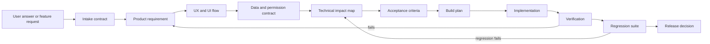

# Feature Development Pipeline v0.1

**Purpose:** Convert a product answer or requested function into a traceable requirement, UX flow, implementation map, and regression plan.

## Pipeline

## Gates

| Gate | Name | Required output | Decision |
|---|---|---|---|
| G0 | Intake | Feature request with user, problem, trigger, and desired outcome | Accept, clarify, or reject |
| G1 | Requirement | Functional and non-functional requirements | Ready for UX |
| G2 | UX flow | Screen states, actions, validations, empty/error/success states | Ready for contract |
| G3 | Contract | Data, permissions, events, API/domain impacts | Ready for build |
| G4 | Build plan | Files/modules, sequence, dependencies, risks | Ready to implement |
| G5 | Verification | Acceptance test results and evidence | Pass or return |
| G6 | Regression | Existing behavior remains valid | Release or block |

## Roles

- **Product Manager:** scope, priority, decision, trade-off, and release gate.
- **UX/UI:** user flow, content, states, accessibility, and interaction behavior.
- **Requirements analyst:** traceability, acceptance criteria, and change impact.
- **Technical lead:** architecture, data contracts, implementation map, and risks.
- **QA:** verification, regression cases, and evidence.

Until application code exists, the project is operating through G0–G3. Implementation begins at G4 after the MVP contract is approved.

## Required artifacts for every new function

1. Feature intake record
2. Requirement specification
3. UX/UI flow map
4. Data and permission contract
5. Technical impact map
6. Acceptance criteria
7. Build plan
8. Regression cases
9. Decision record

## Definition of ready

A feature is ready for implementation only when the team can answer:

- Who uses it?
- What problem does it solve?
- What starts the flow?
- What are the screens and states?
- What data is created or changed?
- Who can read or modify it?
- What happens on invalid, empty, delayed, or failed states?
- What existing behavior could break?
- How will QA prove it works?

## Definition of done

A feature is done only when:

- acceptance criteria pass;
- data and permission behavior pass;
- empty, error, loading, and success states exist;
- regression cases pass;
- evidence is recorded;
- documentation and contracts are updated;
- release status is explicitly marked.
