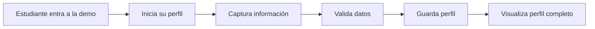

# Human Intelligence Platform — Product Capability Description v0.2

## 1. Definición de plataforma

Human Intelligence Platform es una **Human-in-the-Loop Digital Twin Platform**: una plataforma donde cada persona puede gestionar una representación digital persistente, autorizada y orientada a metas de sí misma.

La plataforma conecta identidad, estado, contexto, metas, eventos, evidencias y capacidades. Los agentes de IA pueden ayudar a interpretar la información y proponer acciones, pero la persona conserva el control sobre sus datos, decisiones y objetivos.

Su propósito no es crear un perfil estático. Su propósito es ayudar a la persona a convertir información y experiencia en progreso humano verificable.

La primera implementación se enfocará en estudiantes como **primer dominio o beachhead**, no como definición total de la plataforma.

## 2. Modelo de funcionamiento

```text
PERSONA
  ↓
IDENTIDAD + CONSENTIMIENTO
  ↓
HUMAN DIGITAL TWIN CORE
  ↓
EVIDENCIA + CAPACIDADES + METAS
  ↓
CONTEXTO AUTORIZADO
  ↓
AGENTE DE IA
  ↓
RECOMENDACIÓN / PLAN / SIGUIENTE ACCIÓN
  ↓
DECISIÓN HUMANA
  ↓
ACCIÓN + RESULTADO
  ↺
NUEVO EVENTO / EVIDENCIA / PROGRESO
```

La persona permanece dentro del ciclo. El agente no es la fuente de verdad ni toma decisiones autónomas fuera de los permisos y controles definidos.

## 3. Qué puede hacer la plataforma por diseño

### Gestionar el Human Digital Twin Core

El núcleo mantiene una representación longitudinal y permission-aware de:

- identidad;
- estado actual;
- contexto;
- metas;
- eventos;
- referencias a evidencias y capacidades.

### Organizar evidencias

El Evidence Graph responde:

> ¿Cómo sabemos esto?

Relaciona certificados, proyectos, evaluaciones, repositorios, eventos y otras fuentes con procedencia explícita.

### Representar capacidades

El Capability Graph responde:

> ¿Qué puede hacer demostrablemente esta persona?

Relaciona conocimiento, habilidades, competencias, experiencia, capacidades, roles y metas.

### Crear vistas de dominio

Un mismo Human Twin Core puede tener vistas permissioned para:

- Education Twin;
- Professional Twin;
- Worker Twin;
- Athlete Twin;
- Care Twin.

Estas vistas no son identidades separadas ni copias sin control.

### Usar agentes con contexto autorizado

Los agentes pueden proponer explicaciones, recomendaciones, planes, alertas o siguientes acciones usando:

```text
Estado autorizado
+ Evidencia relevante
+ Capacidades
+ Contexto actual
+ Metas
+ Políticas del dominio
```

## 4. Primer dominio: Student / Education Twin

El primer vertical candidato es el estudiante. Su primera experiencia será crear y consultar una vista privada de su Human Twin enfocada en formación y proyectos.

### Crear un perfil de talento inicial

El estudiante podrá capturar:

- nombre;
- carrera o programa académico;
- progreso de la carrera;
- fecha estimada o prevista de graduación;
- proyectos realizados;
- proyectos en proceso.

### Guardar la información

El sistema deberá conservar el perfil asociado al estudiante para que pueda consultarlo después.

### Ver el perfil completo

Después de guardar la información, el estudiante podrá visualizar todos sus datos en una vista consolidada.

### Mantener privacidad

En la primera versión, únicamente el estudiante podrá consultar su perfil. La visibilidad para universidades, empresas u otras personas queda como función futura y requerirá consentimiento explícito.

## 5. Flujo principal de la primera demo



## 6. Funciones futuras

- publicar selectivamente el perfil;
- compartir el perfil mediante consentimiento;
- permitir que universidades o empresas consulten perfiles autorizados;
- agregar evidencias de cursos, certificaciones y proyectos;
- recibir recomendaciones de desarrollo;
- conectar oportunidades locales con talento disponible;
- medir progreso académico y profesional;
- habilitar agentes de orientación educativa y profesional.

La expansión deberá seguir el alcance gobernado del repositorio: Human Twin Core, Evidence Graph, Capability Graph, un dominio, un agente y evidencia de resultados antes de ampliar a otros dominios.

## 7. Lo que todavía no existe o no debe afirmarse

Actualmente no hay evidencia de:

- código funcional de la aplicación;
- demo ejecutable;
- usuarios de prueba;
- perfiles almacenados en producción;
- recomendaciones generadas por agentes;
- Evidence Graph implementado;
- Capability Graph implementado;
- clientes, pilotos, ingresos o tracción.

La arquitectura SVG y el contrato JSON demuestran una **definición conceptual de arquitectura**, no una implementación funcional.

## 8. Descripción corta para presentar el producto

> Human Intelligence Platform ayuda a los estudiantes a construir un registro privado y estructurado de su formación, progreso y proyectos, creando la base para una futura representación verificable de sus capacidades y oportunidades de desarrollo.

Descripción de plataforma:

> Human Intelligence Platform es una plataforma Human-in-the-Loop Digital Twin que permite a las personas gestionar una representación digital de su identidad, estado, evidencias, capacidades y metas para tomar mejores decisiones y alcanzar progreso humano verificable.

## 9. Estado de producto

| Capacidad | Estado |
|---|---|
| Definición de plataforma Human-in-the-Loop Digital Twin | Documentada |
| Arquitectura visual | Documentada y verificada |
| Student / Education domain view | Primer beachhead propuesto |
| Perfil privado del estudiante | Primera vertical slice |
| Human Twin Core funcional | Pendiente |
| Evidence Graph funcional | Pendiente |
| Capability Graph funcional | Pendiente |
| Agente funcional | Pendiente |
| Código de aplicación | Pendiente |
| Demo ejecutable | Pendiente |
| Visibilidad externa | Función futura |
| Recomendaciones inteligentes | Función futura |
| Evidencia y capacidades graficadas | Hipótesis técnica |
