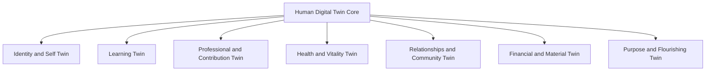

# Alternate Human Flourishing Domain Model v0.1

**Status:** HYPOTHESIS / PARALLEL ALTERNATIVE  
**Relationship to canonical architecture:** Does not replace the current five-domain baseline  
**Purpose:** Explore a broader human-flourishing model for future domain design

## 1. Design decision

The repository keeps the current five-domain architecture as the canonical baseline:

```text
Education Twin
Professional Twin
Worker Twin
Athlete Twin
Care Twin
```

This document introduces a parallel alternative organized around seven broader areas of human flourishing. It is a conceptual hypothesis and does not change the current architecture contract until separately approved through an ADR or a new contract version.

## 2. Parallel seven-domain model



### 1. Identity and Self Twin

Identity, values, personality, strengths, emotional context, self-knowledge and personal development.

### 2. Learning Twin

Education, knowledge, skills, credentials, learning goals and continuous development.

### 3. Professional and Contribution Twin

Career, work, projects, experience, productivity, collaboration and contribution to society.

### 4. Health and Vitality Twin

Physical health, mental wellbeing, habits, energy, sleep, activity and performance.

### 5. Relationships and Community Twin

Family, friendships, support networks, collaboration, belonging and community participation.

### 6. Financial and Material Twin

Income, financial security, resources, material conditions and economic goals.

### 7. Purpose and Flourishing Twin

Life goals, meaning, creativity, spirituality, civic impact, contribution and perceived progress.

## 3. Mapping from the canonical five-domain model

| Canonical domain | Alternate seven-domain mapping | Interpretation |
|---|---|---|
| Education Twin | Learning Twin | Direct mapping |
| Professional Twin | Professional and Contribution Twin | Broader career and contribution view |
| Worker Twin | Professional and Contribution Twin | Work-specific extension |
| Athlete Twin | Health and Vitality Twin | Physical performance extension |
| Care Twin | Health and Vitality Twin / Relationships and Community Twin | Care context may cross both domains |
| No current equivalent | Identity and Self Twin | New cross-cutting personal domain |
| No current equivalent | Financial and Material Twin | New life-stability domain |
| No current equivalent | Purpose and Flourishing Twin | New meaning and outcome domain |

## 4. Parallel architecture rule

The two models coexist as follows:

```text
ONE HUMAN DIGITAL TWIN CORE
        │
        ├── Canonical five-domain model
        │      ├── Education
        │      ├── Professional
        │      ├── Worker
        │      ├── Athlete
        │      └── Care
        │
        └── Alternate seven-domain flourishing model
               ├── Identity and Self
               ├── Learning
               ├── Professional and Contribution
               ├── Health and Vitality
               ├── Relationships and Community
               ├── Financial and Material
               └── Purpose and Flourishing
```

Neither model creates seven independent human identities. Both are possible permissioned views or extensions of the same Human Digital Twin Core.

## 5. Interconnection principle

Interconnection must occur through governed references, not unrestricted data sharing.

```text
Identity
↓
Consent
↓
Purpose
↓
Minimum required data
↓
Authorized domain view
↓
Audit
```

Example: a student's learning progress may inform a professional goal only when the person authorizes that use. Health, care or financial data should not automatically flow into professional or learning views.

## 6. Design implications

The seven-domain model is potentially better for human-flourishing research because it includes identity, relationships, financial stability and purpose. The five-domain model is currently more concrete for product and workload design because it maps more directly to education, career, work, sport and care use cases.

The project should therefore use:

- the five-domain model for the current canonical repository baseline;
- the seven-domain model for strategic product exploration and future domain design;
- a domain decision matrix before changing the architecture contract;
- an ADR before adding, merging or renaming canonical domains.

## 7. Current status

```text
Canonical architecture: five domains / BASELINE
Alternate flourishing model: seven domains / HYPOTHESIS
Implementation: none of the domain twins validated as production software
Decision required: select the domain ontology before domain expansion
```
