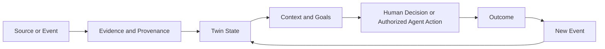

# Personal and Enterprise Digital Twin Reference Architecture v0.2

**Status:** PROPOSED ARCHITECTURE  
**Contract:** `contracts/architecture/PERSONAL_ENTERPRISE_DIGITAL_TWIN_ARCHITECTURE_CONTRACT_v0.2.json`  
**Canonical baseline:** The current five-domain architecture remains unchanged until this proposal is promoted.

## Core thesis

Human Intelligence Platform is a Human-in-the-Loop Digital Twin platform where people and organizations manage governed digital representations to achieve measurable progress.

```mermaid
flowchart TD
    H[Human Intelligence Platform] --> P[Personal Digital Twin]
    H --> E[Enterprise Digital Twin]
    H --> R[Authorized Relationship Layer]

    P --> P1[Identity and Self]
    P --> P2[Health and Vitality]
    P --> P3[Learning and Capabilities]
    P --> P4[Work and Contribution]
    P --> P5[Relationships and Community]
    P --> P6[Resources and Security]
    P --> P7[Purpose and Flourishing]

    E --> E1[Organization and Identity]
    E --> E2[People and Capabilities]
    E --> E3[Resources and Assets]
    E --> E4[Processes and Operations]
    E --> E5[Customers and Ecosystem]
    E --> E6[Risk and Compliance]
    E --> E7[Strategy and Outcomes]

    E --> S1[People Twins]
    E --> S2[Asset Twins]
    E --> S3[Process Twins]
    E --> S4[Product Twins]
    E --> S5[Organization State]

    R --> R1[Roles]
    R --> R2[Projects]
    R --> R3[Permissions]
    R --> R4[Skills]
    R --> R5[Goals]
    R --> R6[Outcomes]

    P -. governed relationship .-> R
    E -. governed relationship .-> R
```



## Twin minimum model



Every twin needs more than a profile record. It needs a time-aware state model, events, context, goals, evidence, relationships, transition rules, actions, outcomes and governance.

## Personal Digital Twin

The Personal Digital Twin is person-centered. The person controls the identity and authorizes domain views.

It may include:

- identity and self-understanding;
- health and vitality;
- learning and capabilities;
- work and contribution;
- relationships and community;
- resources and security;
- purpose and flourishing.

## Enterprise Digital Twin

The Enterprise Digital Twin represents an organization as a system, not as one asset record.

It may include:

- organization identity and structure;
- people and capabilities;
- resources and physical or digital assets;
- processes and operations;
- customers and ecosystem;
- risk and compliance;
- strategy and outcomes.

The enterprise may contain nested twins:

```text
Enterprise Digital Twin
    ├── People Twins
    ├── Asset Twins
    ├── Process Twins
    ├── Product Twins
    └── Organization State
```

## Authorized Relationship Layer

The relationship layer connects a person and an enterprise without merging their twins.

Examples:

- a person holds a role in an organization;
- a person contributes to a project;
- a capability satisfies a skill requirement;
- an enterprise authorizes access to a workflow;
- a goal produces a measurable outcome.

Every relationship must have a purpose, owner, permissions, validity period and audit trail.

## Digital Twin versus profile database

| Profile database | Digital Twin |
|---|---|
| Stores attributes | Maintains a time-aware state model |
| Represents a snapshot | Represents change over time |
| May lack event causality | Updates through events |
| May lack provenance | Links claims to evidence |
| Stores goals as fields | Evaluates state against goals |
| Does not imply behavior | Defines transitions and actions |
| Does not imply outcomes | Records feedback and measurable results |
| Access is often record-based | Access is purpose-, role- and consent-based |

## MVP rule

The full architecture is the product thesis. The MVP must implement only one bounded vertical slice. The current candidate is a Personal Digital Twin slice for Learning and Capabilities, beginning with the student's private profile and extending only when state, evidence, goal and outcome behavior are defined.
