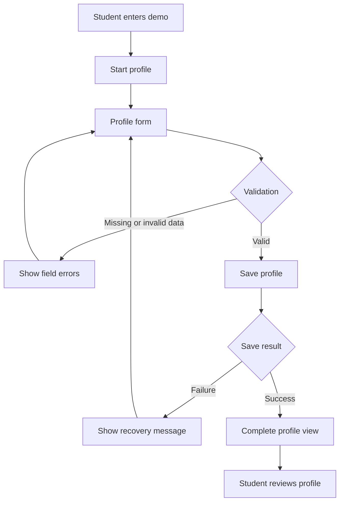

# FEAT-001 — Student talent profile

**Status:** READY FOR UX DETAIL / NOT READY FOR BUILD  
**Priority:** P0  
**User:** Student  
**Buyer hypothesis:** Student  
**Visibility:** Private to the student in MVP

> This feature is the first vertical slice of the broader Human-in-the-Loop Digital Twin Platform. It is not the complete platform MVP.

## Problem

The student lacks a continuous record of talent because relevant information is disconnected. The first product response is a private, structured profile that gives the student a complete view of their current academic and project context.

## Desired outcome

The student creates a profile and can view the complete saved profile.

## MVP requirements

| ID | Requirement | Type |
|---|---|---|
| REQ-001 | Student can start a new profile | Functional |
| REQ-002 | Profile captures name | Data |
| REQ-003 | Profile captures degree or career | Data |
| REQ-004 | Profile captures degree progress | Data |
| REQ-005 | Profile captures graduation date | Data |
| REQ-006 | Profile captures completed projects | Data |
| REQ-007 | Profile captures projects in progress | Data |
| REQ-008 | Student can save the profile | Functional |
| REQ-009 | Student can view the complete saved profile | Functional |
| REQ-010 | Only the student can read the profile in MVP | Privacy |

## UX flow

## Required states

- Entry: explain profile purpose and privacy.
- Form: show the six minimum fields.
- Validation: identify missing or invalid values next to the field.
- Loading: show that the save operation is in progress.
- Error: preserve entered data and offer retry.
- Success: display the complete saved profile.
- Unauthorized: reject access from anyone other than the owner.

## Acceptance criteria

1. **Given** a student starts a new profile, **when** they enter all required fields and save, **then** the system stores the profile and displays the complete profile view.
2. **Given** a required field is missing, **when** the student saves, **then** the system identifies the field and does not create an incomplete profile.
3. **Given** the save request fails, **when** the error is returned, **then** the system preserves the entered values and allows retry.
4. **Given** another user or anonymous visitor requests the profile, **when** the profile is private, **then** the system denies access.
5. **Given** the student reloads the profile view, **when** the profile exists, **then** all saved fields remain accurate.

## Technical build map

| Layer | Initial work |
|---|---|
| UX | Entry, form, validation, loading, error, success, unauthorized states |
| Frontend | Profile route, form component, profile view, client validation |
| Backend | Create profile and read-own-profile operations |
| Data | Student profile entity with six minimum fields and owner ID |
| Security | Owner-only read policy |
| Testing | Unit validation, create/read integration, authorization, reload persistence, regression |

## Not in MVP

- Public discovery
- University or employer search
- External sharing
- Recommendations
- Automatic talent inference
- Evidence graph ingestion
- Agent workflows
